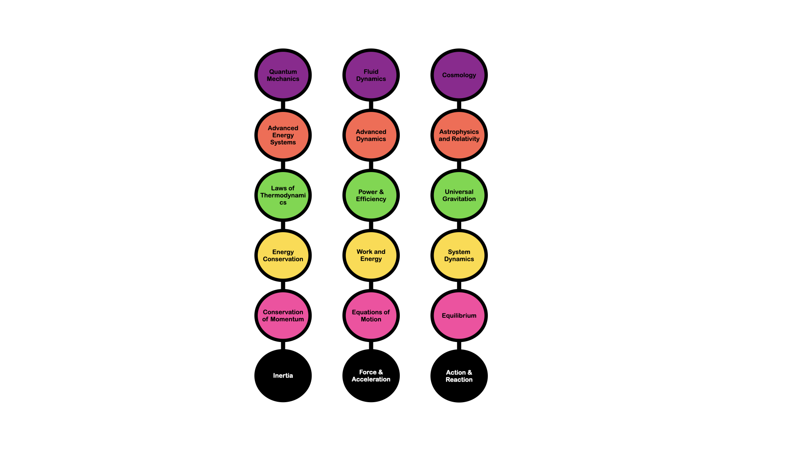

# PhysicsFlow

## Overview
PhysicsFlow explores patterns in motion and systems through intuitive models, enhancing analytical skills for optimizing tech and DevOps workflows. It’s a passion project visualizing how forces and motion create universal patterns, applicable to infrastructure design and problem-solving.

## What’s Inside
- **Diagrams**: Visual models of motion, like planetary orbits as dips in a flexible system, showing how gravity and inertia shape paths.
- **Notes**: Explanations of motion, gravity, and system dynamics, tying physics to tech optimization (e.g., system flows, performance).
- **Projects**: Optional—any code or simulations (e.g., Python orbit visuals), if you create them later, keeping it simple and intuitive.

## Why It Matters
These insights sharpen pattern recognition and creative problem-solving, directly applicable to optimizing computer systems, cloud infrastructure, and DevOps workflows. Think of it as understanding how stable systems (like orbits) can inspire reliable tech design.

## Getting Started
Browse the `diagrams/` folder for visuals or `docs/` for notes. No technical background needed—just curiosity about motion and systems!

## Contact
Connect with me on LinkedIn or check my CV for more on how physics enhances my tech skills. Feedback welcome—let’s discuss how these patterns apply to tech!

## License
MIT License (or Apache, open-source friendly for tech communities).
